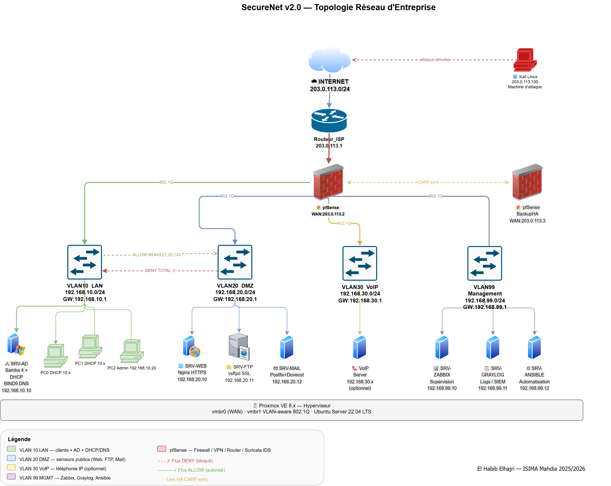

# 🔐 SecureNet v2.0 — Enterprise Network Infrastructure


> **Academic project** — Full virtualized enterprise network infrastructure built on open-source tools.  
> Successor to [SecureNet v1.0](https://github.com/elhabibelhajri) (Cisco Packet Tracer / IPFire).

**Author:** Elhabib Elhajri — [@elhabibelhajri](https://linkedin.com/in/elhabibelhajri)  
**Institution:** ISIMA Mahdia — Université de Monastir  
**Level:** L2 Ingénierie des Réseaux et Systèmes  
**Duration:** 12 weeks

---

## 📋 Table of Contents

- [Overview](#-overview)
- [What's New vs v1.0](#-whats-new-vs-v10)
- [Network Topology](#-network-topology)
- [IP Addressing & VLANs](#-ip-addressing--vlans)
- [Technology Stack](#-technology-stack)
- [Project Structure](#-project-structure)
- [Weekly Progress](#-weekly-progress)
- [Firewall Rules](#-firewall-rules)
- [How to Use](#-how-to-use)
- [Screenshots](#-screenshots)
- [Resources](#-resources)

---

## 🎯 Overview

SecureNet v2.0 simulates a complete enterprise network infrastructure using real virtualization with **Proxmox VE**. The project covers network segmentation, firewall management, Active Directory, PKI-based VPN, intrusion detection, monitoring, log centralization, and automation.

**Key objectives:**
- Deploy enterprise firewall with pfSense and strict ACL rules
- Segment the network using 4 VLANs (LAN, DMZ, VoIP, Management)
- Implement open-source Active Directory with Samba 4
- Configure PKI-based VPN with certificate authentication
- Detect and block intrusions in real time with Suricata IDS/IPS
- Monitor full infrastructure with Zabbix
- Centralize security logs with Graylog (SIEM)
- Automate deployments with Ansible
- Ensure high availability with pfSense CARP failover

---

## 🆚 What's New vs v1.0

| Feature | v1.0 (Packet Tracer) | v2.0 (Proxmox + Linux) |
|---------|----------------------|------------------------|
| Environment | Software simulation | Real VMs |
| Firewall | IPFire (basic) | pfSense CE + Suricata IDS/IPS |
| Network segmentation | None | 4 VLANs (802.1Q) |
| Directory service | None | Active Directory (Samba 4) |
| VPN | Pre-shared keys | PKI + certificates (Easy-RSA) |
| Monitoring | None | Zabbix + Graylog |
| Automation | Manual | Ansible playbooks |
| High Availability | None | pfSense CARP failover |

---

## 🗺 Network Topology



The architecture is organized into **5 distinct zones** interconnected via pfSense:

```
INTERNET (203.0.113.0/24)
        |
   [Routeur ISP]
        |
   [pfSense HA] ←——— CARP sync ———→ [pfSense Backup]
   WAN: 203.0.113.2                  WAN: 203.0.113.3
   VIP: 203.0.113.4
        |
   _____|_____________________________
   |         |           |           |
VLAN10     VLAN20      VLAN30      VLAN99
 LAN        DMZ         VoIP        MGMT
```

---

## 📊 IP Addressing & VLANs

| VLAN ID | Name | Network | Gateway | Role |
|---------|------|---------|---------|------|
| 10 | LAN | 192.168.10.0/24 | 192.168.10.1 | Clients + AD + DHCP/DNS |
| 20 | DMZ | 192.168.20.0/24 | 192.168.20.1 | Public servers (Web, FTP, Mail) |
| 30 | VoIP | 192.168.30.0/24 | 192.168.30.1 | IP Telephony (optional) |
| 99 | Management | 192.168.99.0/24 | 192.168.99.1 | Zabbix, Graylog, Ansible |
| — | WAN | 203.0.113.0/24 | 203.0.113.1 | Internet (simulated) |

### Detailed IP Plan

| Machine | Zone | IP Address | Role |
|---------|------|-----------|------|
| pfSense (primary) | WAN | 203.0.113.2 | Firewall / Router / VPN |
| pfSense (backup HA) | WAN | 203.0.113.3 | CARP failover |
| pfSense VIP | WAN | 203.0.113.4 | Virtual IP CARP |
| SRV-AD | VLAN10 | 192.168.10.10 | Samba 4 AD + BIND9 DNS + DHCP |
| PC0, PC1 | VLAN10 | DHCP (10.x) | Client workstations |
| PC2 (admin) | VLAN10 | 192.168.10.20 | Admin workstation |
| SRV-WEB | VLAN20 | 192.168.20.10 | Nginx HTTPS |
| SRV-FTP | VLAN20 | 192.168.20.11 | vsftpd SSL |
| SRV-MAIL | VLAN20 | 192.168.20.12 | Postfix + Dovecot |
| SRV-ZABBIX | VLAN99 | 192.168.99.10 | Network monitoring |
| SRV-GRAYLOG | VLAN99 | 192.168.99.11 | Log centralization |
| SRV-ANSIBLE | VLAN99 | 192.168.99.12 | Automation |
| Kali Linux | WAN | 203.0.113.100 | Simulated attacker |

---

## 🛠 Technology Stack

| Role | Tool | Version | License |
|------|------|---------|---------|
| Hypervisor | Proxmox VE | 8.x | AGPL v3 |
| Firewall / VPN | pfSense CE | 2.7.x | Apache 2.0 |
| Server OS | Ubuntu Server | 22.04 LTS | GPL |
| Active Directory | Samba 4 | 4.18+ | GPL v3 |
| DNS | BIND9 | 9.18 | MPL 2.0 |
| DHCP | ISC DHCP | 4.4 | MPL 2.0 |
| Web Server | Nginx | 1.24 | BSD |
| Mail Server | Postfix + Dovecot | 3.7 | IBM/MIT |
| FTP Server | vsftpd | 3.0 | GPL v2 |
| IDS/IPS | Suricata | 7.x | GPL v2 |
| Monitoring | Zabbix | 7.0 | GPL v2 |
| Log Management | Graylog CE | 5.x | SSPL |
| Automation | Ansible | 2.16 | GPL v3 |
| PKI | Easy-RSA | 3.x | GPL v2 |
| Penetration Testing | Kali Linux | 2024.x | GPL |

---

## 📁 Project Structure

```
securenet-v2/
├── README.md
├── docs/
│   ├── SecureNet_v2_Topology.drawio.png   # Network diagram
│   ├── ip-addressing.md                    # Detailed IP plan
│   └── weekly-progress.md                  # Weekly journal
├── configs/
│   ├── pfsense/
│   │   ├── firewall-rules.md              # ACL rules
│   │   └── nat-rules.md                   # NAT / Port Forward
│   ├── bind9/
│   │   └── db.securenet.local             # DNS zone file
│   ├── dhcp/
│   │   └── dhcpd.conf                     # DHCP config
│   ├── nginx/
│   │   └── securenet.conf                 # Web server config
│   └── postfix/
│       └── main.cf                        # Mail server config
├── ansible/
│   ├── inventory.yml                      # Hosts inventory
│   ├── playbook-update.yml                # Update all servers
│   ├── playbook-nginx.yml                 # Deploy Nginx
│   └── roles/                             # Ansible roles
├── suricata/
│   └── custom-rules.rules                 # Custom IDS rules
└── screenshots/
    ├── zabbix-dashboard.png
    ├── graylog-dashboard.png
    └── suricata-alerts.png
```

---

## 📅 Weekly Progress

| Week | Topic | Status |
|------|-------|--------|
| 1 | Proxmox VE — Hypervisor setup | ⬜ Planned |
| 2 | pfSense — Advanced firewall & routing | ⬜ Planned |
| 3 | VLANs — 802.1Q network segmentation | ⬜ Planned |
| 4 | DHCP, DNS & network services | ⬜ Planned |
| 5 | Active Directory with Samba 4 | ⬜ Planned |
| 6 | PKI-based VPN with OpenVPN | ⬜ Planned |
| 7 | DMZ services — Web, FTP, Mail | ⬜ Planned |
| 8 | IDS/IPS with Suricata | ⬜ Planned |
| 9 | Monitoring with Zabbix | ⬜ Planned |
| 10 | Log centralization with Graylog | ⬜ Planned |
| 11 | Automation with Ansible | ⬜ Planned |
| 12 | High Availability & final documentation | ⬜ Planned |

---

## 🔒 Firewall Rules

| Source | Destination | Ports | Action |
|--------|-------------|-------|--------|
| LAN (VLAN10) | Internet (WAN) | 80, 443, 53, 25, 22 | ✅ ALLOW |
| LAN (VLAN10) | DMZ (VLAN20) | 80, 443, 21, 25, 143 | ✅ ALLOW |
| LAN (VLAN10) | MGMT (VLAN99) | All | ✅ ALLOW (admins) |
| DMZ (VLAN20) | LAN (VLAN10) | — | ❌ DENY ALL |
| DMZ (VLAN20) | Internet (WAN) | 80, 443, 25, 53 | ✅ ALLOW |
| Internet (WAN) | DMZ (VLAN20) | 80, 443, 21, 25 | ✅ ALLOW (NAT) |
| Internet (WAN) | LAN (VLAN10) | — | ❌ DENY ALL |
| Internet (WAN) | pfSense VPN | 1194/UDP | ✅ ALLOW VPN |
| MGMT (VLAN99) | All | All | ✅ ALLOW (supervision) |

---

## 🚀 How to Use

### Prerequisites
- Machine with 16 GB RAM, 8-core CPU, 250 GB SSD
- Virtualization enabled in BIOS (VT-x / AMD-V)
- Proxmox VE 8.x installed (bare-metal)

### Quick Start

```bash
# 1. Clone this repository
git clone https://github.com/elhabibelhajri/securenet-v2.git
cd securenet-v2

# 2. Follow the weekly guide in docs/weekly-progress.md

# 3. Run Ansible playbooks (after Week 11)
cd ansible/
ansible all -m ping
ansible-playbook playbook-update.yml
```

### Validation Tests

| Test | Command | Expected Result |
|------|---------|----------------|
| DMZ → LAN blocked | `ping 192.168.10.10` from SRV-WEB | Timeout |
| WAN → DMZ accessible | `curl https://203.0.113.2` from Kali | Web page |
| VPN functional | Connect OpenVPN + ping LAN | Success |
| AD authentication | Login `alice@securenet.local` | Success |
| Suricata alert | `nmap -sS 203.0.113.2` from Kali | Alert triggered |
| HA failover | Shutdown primary pfSense | Failover < 10s |

---

## 📸 Screenshots

> Screenshots will be added as each week is completed.

| Component | Screenshot |
|-----------|-----------|
| pfSense Dashboard | *coming soon* |
| Zabbix Monitoring | *coming soon* |
| Graylog SIEM | *coming soon* |
| Suricata Alerts | *coming soon* |
| Samba AD Users | *coming soon* |

---

## 📚 Resources

| Resource | URL |
|----------|-----|
| Proxmox VE Docs | [pve.proxmox.com/wiki](https://pve.proxmox.com/wiki/Main_Page) |
| pfSense Docs | [docs.netgate.com](https://docs.netgate.com/pfsense/en/latest/) |
| Samba 4 Wiki | [wiki.samba.org](https://wiki.samba.org/index.php/Setting_up_Samba_as_an_AD_DC) |
| Suricata Docs | [suricata.readthedocs.io](https://suricata.readthedocs.io) |
| Zabbix Docs | [zabbix.com/documentation](https://www.zabbix.com/documentation/7.0/) |
| Graylog Docs | [go2docs.graylog.org](https://go2docs.graylog.org) |
| Ansible Docs | [docs.ansible.com](https://docs.ansible.com) |
| Easy-RSA | [github.com/OpenVPN/easy-rsa](https://github.com/OpenVPN/easy-rsa) |

---

## 📄 License

This project is licensed under the MIT License — see [LICENSE](LICENSE) for details.

---

<div align="center">

**Elhabib Elhajri**  
L2 Ingénierie des Réseaux et Systèmes — ISIMA Mahdia  
[](https://linkedin.com/in/elhabibelhajri)
[](https://github.com/elhabibelhajri)

</div>
